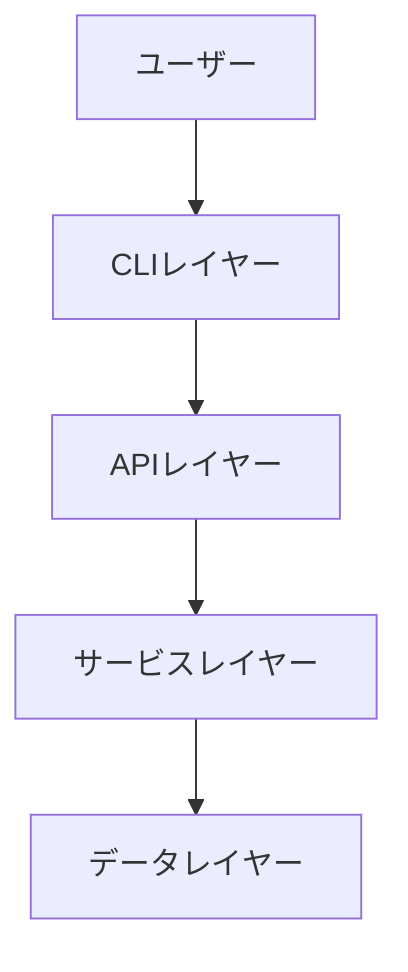
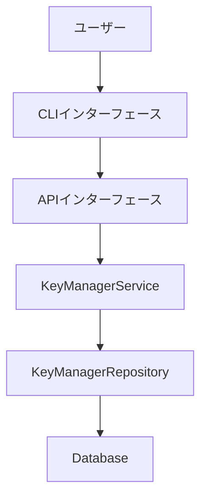
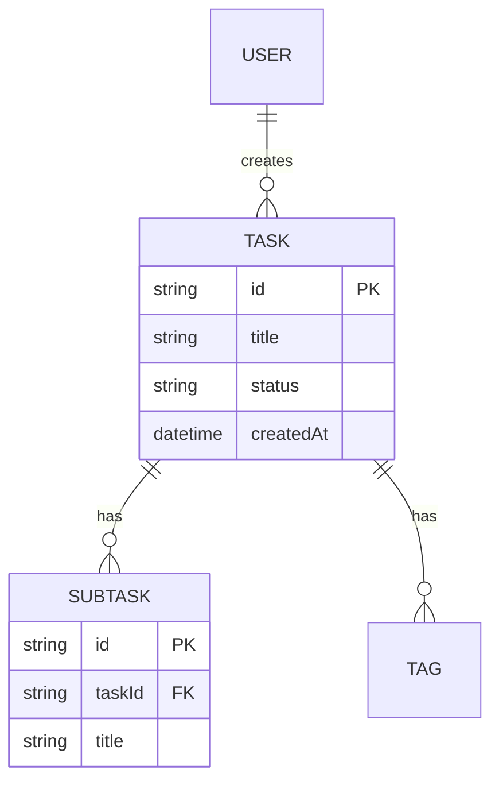
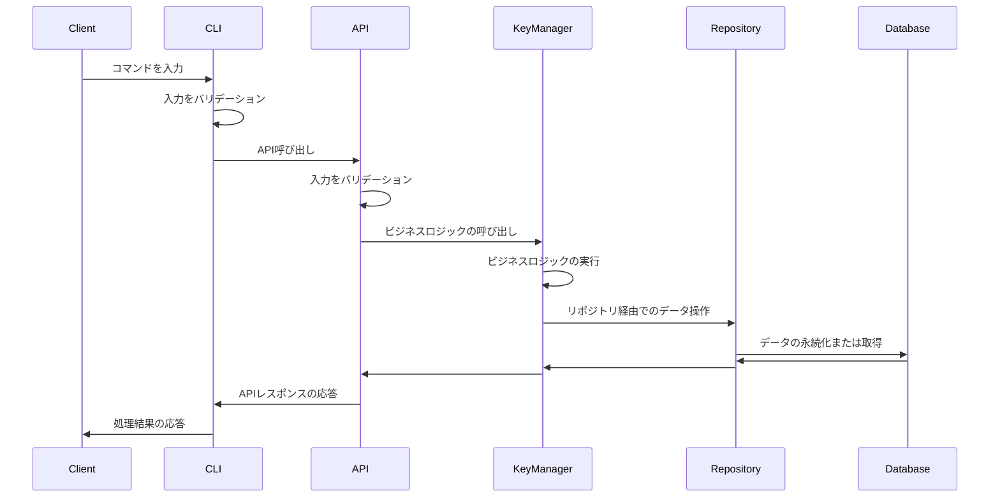

# 機能設計書作成ガイド

このガイドは、プロダクト要求定義書(PRD)に基づいて機能設計書を作成するための実践的な指針を提供します。

## 機能設計書の目的

機能設計書は、PRDで定義された「何を作るか」を「どう実現するか」に落とし込むドキュメントです。

**主な内容**:
- システム構成図
- APIインタフェース
- CLIインタフェース
- データモデル
- コンポーネント設計
- アルゴリズム設計（該当する場合）
- エラーハンドリング

## 作成の基本フロー

### ステップ1: PRDの確認

機能設計書を作成する前に、必ずPRDを確認します。

```
Claude CodeにPRDから機能設計書を作成してもらう際のプロンプト例:

PRDの内容に基づいて機能設計書を作成してください。
特に優先度P0(MVP)の機能に焦点を当ててください。
```

### ステップ2: システム構成図の作成

#### Mermaid記法の使用

システム構成図はMermaid記法で記述します。

**基本的な3層アーキテクチャの例**:


**より詳細な例**:


### ステップ3: APIインタフェースの定義

#### ユーザーと対話しながらOpenAPIまたはGRPCどちらかを選択する
- OpenAPIの場合、OpenAPI形式(yaml)で定義します。

OpenAPI 定義例:
```yaml
openapi: 3.0.3
info:
  title: ユーザー管理 API
  description: ヘキサゴナルアーキテクチャの学習用などに使える、シンプルなユーザー管理APIのサンプルです。
  version: 1.0.0

servers:
  - url: http://localhost:8080/api/v1
    description: ローカル開発環境

paths:
  /users:
    get:
      summary: ユーザー一覧の取得
      operationId: getUsers
      responses:
        '200':
          description: 成功
          content:
            application/json:
              schema:
                type: array
                items:
                  $ref: '#/components/schemas/User'
    post:
      summary: 新規ユーザー登録
      operationId: createUser
      requestBody:
        required: true
        content:
          application/json:
            schema:
              $ref: '#/components/schemas/User'
      responses:
        '201':
          description: 作成完了
          content:
            application/json:
              schema:
                $ref: '#/components/schemas/User'

  /users/{userId}:
    get:
      summary: 特定のユーザー情報を取得
      parameters:
        - name: userId
          in: path
          required: true
          schema:
            type: string
            format: uuid
      responses:
        '200':
          description: 成功
          content:
            application/json:
              schema:
                $ref: '#/components/schemas/User'
        '404':
          description: ユーザーが見つかりません

components:
  schemas:
    User:
      type: object
      required:
        - id
        - name
        - email
      properties:
        id:
          type: string
          format: uuid
          example: "550e8400-e29b-41d4-a716-446655440000"
        name:
          type: string
          example: "山田 太郎"
        email:
          type: string
          format: email
          example: "taro.yamada@example.com"
        role:
          type: string
          enum: [admin, user, guest]
          default: user
```

- GRPCの場合、.protoファイルで定義します。

```proto
syntax = "proto3";

package user.v1;

// Goなどのコード生成用のオプション
option go_package = "gen/go/user/v1;userv1";

// ユーザー管理サービス
service UserService {
  // ユーザー一覧の取得
  rpc GetUsers(GetUsersRequest) returns (GetUsersResponse);

  // 新規ユーザー登録
  rpc CreateUser(CreateUserRequest) returns (User);

  // 特定のユーザー情報を取得
  rpc GetUser(GetUserRequest) returns (User);
}

// ユーザー権限の定義
enum UserRole {
  USER_ROLE_UNSPECIFIED = 0;
  USER_ROLE_ADMIN = 1;
  USER_ROLE_USER = 2;
  USER_ROLE_GUEST = 3;
}

// ユーザーモデル
message User {
  string id = 1;      // UUID
  string name = 2;
  string email = 3;
  UserRole role = 4;
}

// リクエスト・レスポンス用のメッセージ
message GetUsersRequest {}

message GetUsersResponse {
  repeated User users = 1; // 複数人のリスト
}

message CreateUserRequest {
  string name = 1;
  string email = 2;
  UserRole role = 3;
}

message GetUserRequest {
  string id = 1;
}
```

### ステップ4: CLIインターフェース

CLIツールの場合、具体的なコマンド例を記載します:

```bash
# 基本操作
keymng version create #新たな世代の鍵を生成
keymng version list #鍵世代の一覧を表示
keymng version delete <鍵世代番号> #鍵世代に紐づく鍵を削除する
keymng version show <鍵世代番号> #鍵世代に紐づく鍵を表示する
keymng latest # 最新の鍵世代の鍵を表示する
```

### ステップ5: データモデル定義

#### エンティティ定義

データモデルはマークダウンのテーブル形式で定義します。

| 項目名 (論理) | 項目名 (物理) | 型 | 制約 | 説明・例 |
| :--- | :--- | :--- | :--- | :--- |
| ユーザーID | id | UUID | 必須/主キー | 一意の識別子 |
| 名前 | name | String | 必須/最大100文字 | ユーザーの表示名 |
| メールアドレス | email | String | 必須/形式チェック | 連絡先兼ログインID |
| ロール | role | Enum | 必須 / 初期値: user | 権限レベル |
| 作成日時 | created_at | DateTime | システム自動設定 | レコードが作成された日時 |
| 更新日時 | updated_at | DateTime | システム自動設定 | レコードが最後に更新された日時 |

**重要なポイント**:
- 各フィールドにコメントで説明を追加
- 制約（文字数、形式など）を明記
- オプションフィールドには`?`を付ける

#### ER図の作成

複数のエンティティがある場合、ER図で関連を示します。



### ステップ6: コンポーネント設計

各レイヤーの責務を明確にします。

#### CLIレイヤー

**責務**: ユーザー入力の受付、バリデーション、APIリクエストの呼び出し、結果の表示

#### APIレイヤー

**責務**: APIリクエストの受付、バリデーション、ビジネスロジックの呼び出し、結果の返却

#### サービスレイヤー

**責務**: ビジネスロジックの実装

#### データレイヤー

**責務**: データの永続化と取得

### ステップ7: アルゴリズム設計（該当する場合）

機能要件、非機能要件を実現にするにあたり複雑と考えられるロジックは詳細にコードベースで実装例を記述します。

### ステップ8: シーケンス図

主要なユースケースについて、シーケンス図で表現します。

**タスク追加のフロー**:


### ステップ9: エラーハンドリング

エラーの種類と処理方法を定義します。

#### CLIレイヤー
| エラー種別 | 処理 | エラーメッセージ |
|-----------|------|-----------------|
| 入力検証エラー | 処理を中断、エラーメッセージ表示 | "ヘルプを表示してコマンド例を提示する" |
| API呼び出しエラーまたはタイムアウト | 処理を中断、エラーメッセージ表示 | "処理中にエラーが発生しました。(スタックトレースなど詳細を出力)" |

#### APIレイヤー
| エラー種別 | 処理 | エラーメッセージ |
|-----------|------|-----------------|
| 入力検証エラー | 処理を中断、バリデーションエラーを応答 | "バリデーションエラー {スタックトレースなど詳細を出力}" |

#### サービスレイヤー
| エラー種別 | 処理 | エラーメッセージ |
|-----------|------|-----------------|
| ビジネスロジックエラー | 処理を中断、内部エラーを応答 | "処理中にエラーが発生しました。{スタックトレースなど詳細を出力}" |

#### データレイヤー
| エラー種別 | 処理 | エラーメッセージ |
|-----------|------|-----------------|
| データベース接続エラー | 処理を中断、内部エラーを応答 | "処理中にエラーが発生しました。{スタックトレースなど詳細を出力}" |

## 機能設計書のレビュー

### レビュー観点

Claude Codeにレビューを依頼します:

```
この機能設計書を評価してください。以下の観点で確認してください:

1. PRDの要件を満たしているか
2. インタフェース設計は具体的で実装が可能な状態か
3. データモデルは具体的で実装が可能な状態か
4. コンポーネントの責務は明確か
5. アルゴリズムは実装可能なレベルまで詳細化されているか
6. エラーハンドリングは網羅されているか
7. ドキュメント内の各要素について整合性は保たれているか
```

### 改善の実施

Claude Codeの指摘に基づいて改善します。

## まとめ

機能設計書作成の成功のポイント:

1. **PRDとの整合性**: PRDで定義された要件を正確に反映
2. **Mermaid記法の活用**: 図表で視覚的に表現
3. **インタフェース設計**: CLI,API,データモデルの仕様を項目レベルで明確に
4. **詳細なアルゴリズム設計**: 複雑なロジックは具体的に
5. **レイヤー分離**: 各コンポーネントの責務を明確に
6. **実装可能なレベル**: 開発者が迷わず実装できる詳細度