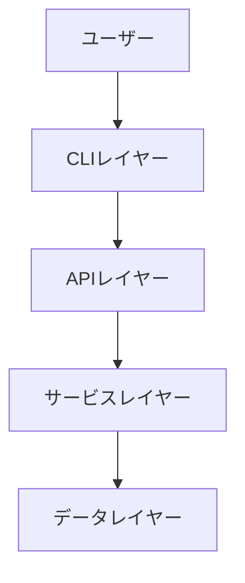
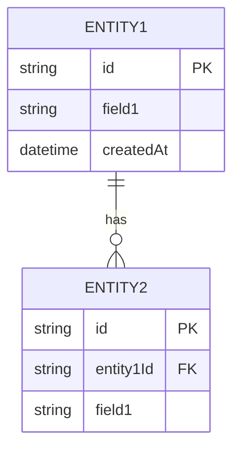
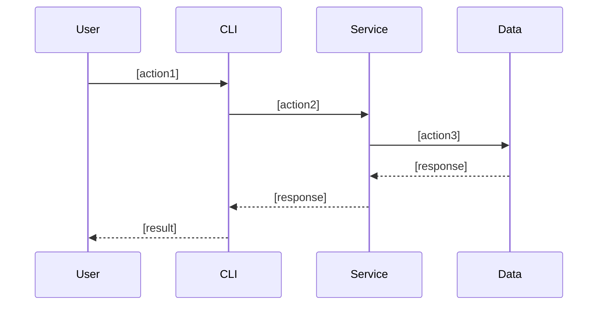

# 機能設計書 (Functional Design Document)

## システム構成図



## 技術スタック

| 分類 | 技術 | 選定理由 |
|------|------|----------|
| 言語 | [言語名] | [理由] |
| フレームワーク | [名称] | [理由] |
| データベース | [名称] | [理由] |
| ツール | [名称] | [理由] |

## APIインタフェース設計

### OpenAPI定義例
```yaml
openapi: 3.0.3
info:
  title: ユーザー管理 API
  description: ヘキサゴナルアーキテクチャの学習用などに使える、シンプルなユーザー管理APIのサンプルです。
  version: 1.0.0

servers:
  - url: http://localhost:8080/api/v1
    description: ローカル開発環境

paths:
  /users:
    get:
      summary: ユーザー一覧の取得
      operationId: getUsers
      responses:
        '200':
          description: 成功
          content:
            application/json:
              schema:
                type: array
                items:
                  $ref: '#/components/schemas/User'
    post:
      summary: 新規ユーザー登録
      operationId: createUser
      requestBody:
        required: true
        content:
          application/json:
            schema:
              $ref: '#/components/schemas/User'
      responses:
        '201':
          description: 作成完了
          content:
            application/json:
              schema:
                $ref: '#/components/schemas/User'

  /users/{userId}:
    get:
      summary: 特定のユーザー情報を取得
      parameters:
        - name: userId
          in: path
          required: true
          schema:
            type: string
            format: uuid
      responses:
        '200':
          description: 成功
          content:
            application/json:
              schema:
                $ref: '#/components/schemas/User'
        '404':
          description: ユーザーが見つかりません

components:
  schemas:
    User:
      type: object
      required:
        - id
        - name
        - email
      properties:
        id:
          type: string
          format: uuid
          example: "550e8400-e29b-41d4-a716-446655440000"
        name:
          type: string
          example: "山田 太郎"
        email:
          type: string
          format: email
          example: "taro.yamada@example.com"
        role:
          type: string
          enum: [admin, user, guest]
          default: user
```

### GRPCの場合、.protoファイルで定義します。

```proto
syntax = "proto3";

package user.v1;

// Goなどのコード生成用のオプション
option go_package = "gen/go/user/v1;userv1";

// ユーザー管理サービス
service UserService {
  // ユーザー一覧の取得
  rpc GetUsers(GetUsersRequest) returns (GetUsersResponse);

  // 新規ユーザー登録
  rpc CreateUser(CreateUserRequest) returns (User);

  // 特定のユーザー情報を取得
  rpc GetUser(GetUserRequest) returns (User);
}

// ユーザー権限の定義
enum UserRole {
  USER_ROLE_UNSPECIFIED = 0;
  USER_ROLE_ADMIN = 1;
  USER_ROLE_USER = 2;
  USER_ROLE_GUEST = 3;
}

// ユーザーモデル
message User {
  string id = 1;      // UUID
  string name = 2;
  string email = 3;
  UserRole role = 4;
}

// リクエスト・レスポンス用のメッセージ
message GetUsersRequest {}

message GetUsersResponse {
  repeated User users = 1; // 複数人のリスト
}

message CreateUserRequest {
  string name = 1;
  string email = 2;
  UserRole role = 3;
}

message GetUserRequest {
  string id = 1;
}
```

### CLIインタフェース設計
```bash
# 基本操作
keymng version create #新たな世代の鍵を生成
keymng version list #鍵世代の一覧を表示
keymng version delete <鍵世代番号> #鍵世代に紐づく鍵を削除する
keymng version show <鍵世代番号> #鍵世代に紐づく鍵を表示する
keymng latest # 最新の鍵世代の鍵を表示する
```

## データモデル定義

### エンティティ: [エンティティ名]

| 項目名 (論理) | 項目名 (物理) | 型 | 制約 | 説明・例 |
| :--- | :--- | :--- | :--- | :--- |
| ユーザーID | id | UUID | 必須/主キー | 一意の識別子 |
| 名前 | name | String | 必須/最大100文字 | ユーザーの表示名 |
| メールアドレス | email | String | 必須/形式チェック | 連絡先兼ログインID |
| ロール | role | Enum | 必須 / 初期値: user | 権限レベル |
| 作成日時 | created_at | DateTime | システム自動設定 | レコードが作成された日時 |
| 更新日時 | updated_at | DateTime | システム自動設定 | レコードが最後に更新された日時 |

**制約**:
- [制約1]
- [制約2]

### ER図



## コンポーネント設計

### [コンポーネント1]

**責務**:
- [責務1]
- [責務2]

**依存関係**:
- [依存先1]
- [依存先2]

## シーケンス図

### [ユースケース1]



**フロー説明**:
1. [ステップ1]
2. [ステップ2]
3. [ステップ3]

**エラーレスポンス**:
- 400 Bad Request: [条件]
- 404 Not Found: [条件]
- 500 Internal Server Error: [条件]

## アルゴリズム設計（該当する場合）

### [アルゴリズム名]

**目的**: [説明]

**実装例**:
```
{ソースコード}
```

## パフォーマンス最適化

- [最適化1]: [説明]
- [最適化2]: [説明]

## セキュリティ考慮事項

- [考慮事項1]: [対策]
- [考慮事項2]: [対策]

## エラーハンドリング

### エラーの分類

| エラー種別 | 処理 | ユーザーへの表示 |
|-----------|------|-----------------|
| [種別1] | [処理内容] | [メッセージ] |
| [種別2] | [処理内容] | [メッセージ] |

## テスト戦略

### ユニットテスト
- [対象1]
- [対象2]

### 統合テスト
- [シナリオ1]
- [シナリオ2]

### E2Eテスト
- [シナリオ1]
- [シナリオ2]