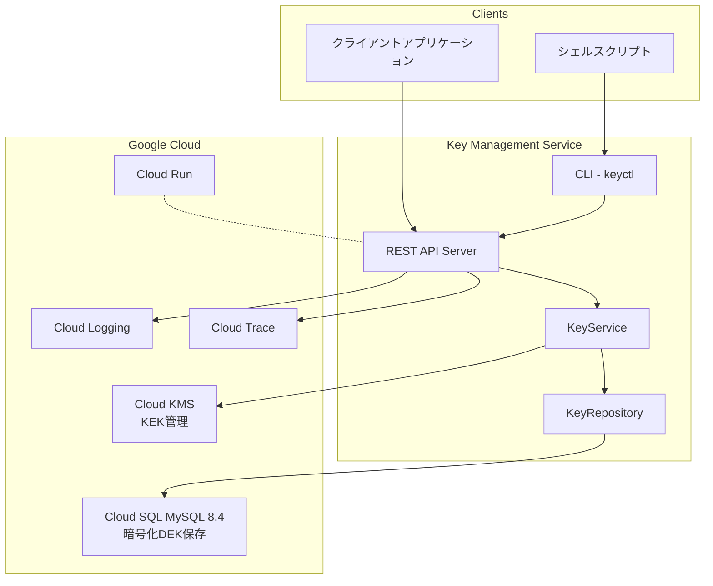
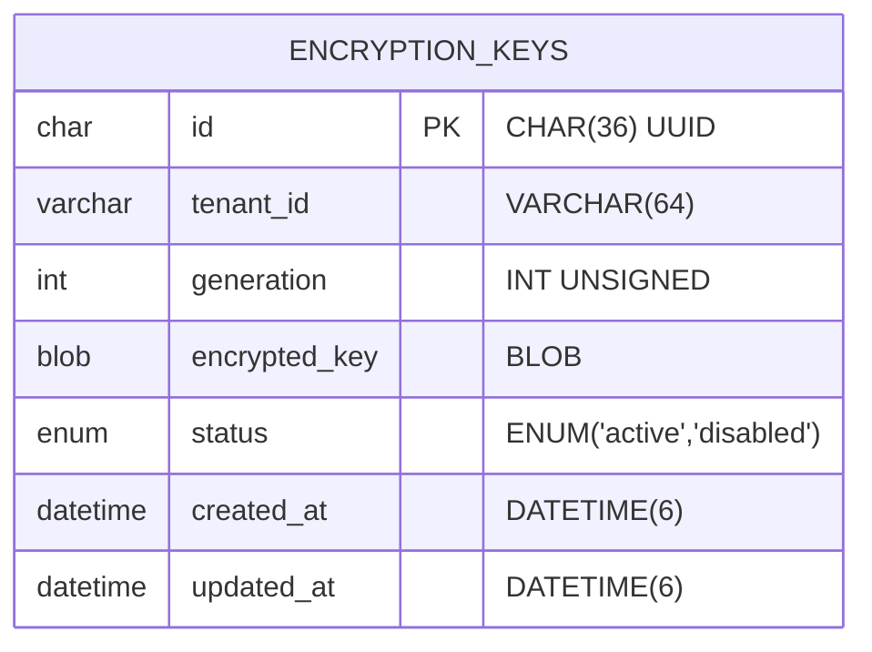
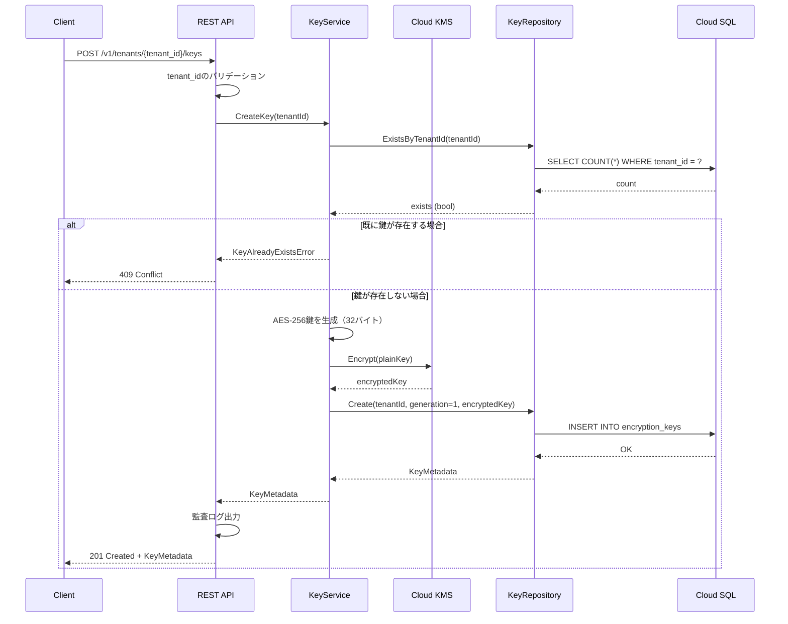
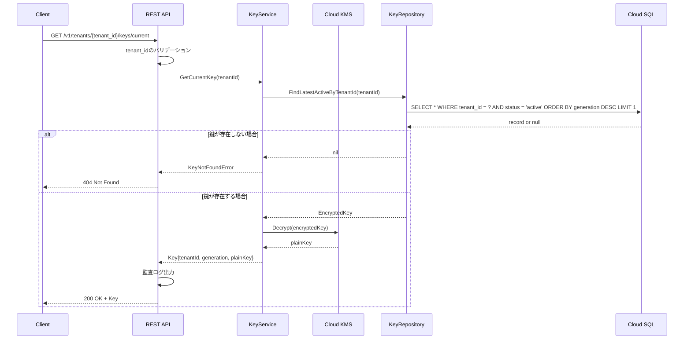
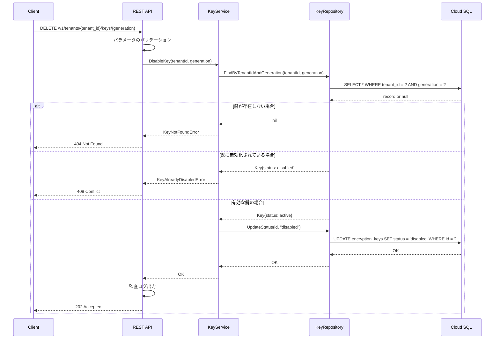

# 機能設計書 (Functional Design Document)

## システム構成図



## 技術スタック

| 分類 | 技術 | 選定理由 |
|------|------|----------|
| 言語 | Go | 要件で指定。Cloud Run との親和性が高い |
| Webフレームワーク | net/http + chi | 軽量で標準ライブラリベース |
| データベース | Cloud SQL (MySQL 8.4) | マネージドRDBMS、トランザクション対応 |
| ORM | gorm | Go標準のORM、マイグレーション機能 |
| 暗号化 | Cloud KMS | エンベロープ暗号化のKEK管理 |
| ログ | slog | Go 1.21+ 標準、構造化ロギング対応 |
| トレーシング | OpenTelemetry | 分散トレーシング標準、Cloud Trace連携 |

## APIインタフェース設計

### OpenAPI定義

```yaml
openapi: 3.0.3
info:
  title: Key Management Service API
  description: 暗号鍵管理マイクロサービスのREST API
  version: 1.0.0

servers:
  - url: https://key-management-service.run.app/v1
    description: 本番環境

paths:
  /tenants/{tenant_id}/keys:
    post:
      summary: 鍵の生成
      description: 指定したテナントに対して新しい暗号鍵（世代1）を生成する
      operationId: createKey
      parameters:
        - $ref: '#/components/parameters/TenantId'
      responses:
        '201':
          description: 鍵の生成に成功
          content:
            application/json:
              schema:
                $ref: '#/components/schemas/KeyMetadata'
        '409':
          description: 既に鍵が存在する
          content:
            application/json:
              schema:
                $ref: '#/components/schemas/Error'

    get:
      summary: 鍵一覧の取得
      description: 指定したテナントの全世代の鍵メタデータを取得する
      operationId: listKeys
      parameters:
        - $ref: '#/components/parameters/TenantId'
      responses:
        '200':
          description: 成功
          content:
            application/json:
              schema:
                $ref: '#/components/schemas/KeyList'

  /tenants/{tenant_id}/keys/current:
    get:
      summary: 現在有効な鍵の取得
      description: 指定したテナントの最新世代（有効な）鍵を取得する
      operationId: getCurrentKey
      parameters:
        - $ref: '#/components/parameters/TenantId'
      responses:
        '200':
          description: 成功
          content:
            application/json:
              schema:
                $ref: '#/components/schemas/Key'
        '404':
          description: 鍵が存在しない
          content:
            application/json:
              schema:
                $ref: '#/components/schemas/Error'

  /tenants/{tenant_id}/keys/{generation}:
    get:
      summary: 特定世代の鍵の取得
      description: 指定したテナント・世代の鍵を取得する
      operationId: getKeyByGeneration
      parameters:
        - $ref: '#/components/parameters/TenantId'
        - $ref: '#/components/parameters/Generation'
      responses:
        '200':
          description: 成功
          content:
            application/json:
              schema:
                $ref: '#/components/schemas/Key'
        '404':
          description: 鍵が存在しない
          content:
            application/json:
              schema:
                $ref: '#/components/schemas/Error'
        '410':
          description: 鍵が無効化されている
          content:
            application/json:
              schema:
                $ref: '#/components/schemas/Error'

    delete:
      summary: 鍵の無効化（論理削除）
      description: 指定したテナント・世代の鍵を無効化する
      operationId: disableKey
      parameters:
        - $ref: '#/components/parameters/TenantId'
        - $ref: '#/components/parameters/Generation'
      responses:
        '202':
          description: 無効化を受け付けた
        '404':
          description: 鍵が存在しない
          content:
            application/json:
              schema:
                $ref: '#/components/schemas/Error'
        '409':
          description: 既に無効化されている
          content:
            application/json:
              schema:
                $ref: '#/components/schemas/Error'

  /tenants/{tenant_id}/keys/rotate:
    post:
      summary: 鍵のローテーション
      description: 指定したテナントに対して新しい世代の鍵を生成する
      operationId: rotateKey
      parameters:
        - $ref: '#/components/parameters/TenantId'
      responses:
        '201':
          description: 新しい世代の鍵を生成した
          content:
            application/json:
              schema:
                $ref: '#/components/schemas/KeyMetadata'
        '404':
          description: テナントの鍵が存在しない
          content:
            application/json:
              schema:
                $ref: '#/components/schemas/Error'

components:
  parameters:
    TenantId:
      name: tenant_id
      in: path
      required: true
      description: テナントID
      schema:
        type: string
        pattern: '^[a-zA-Z0-9_-]+$'
        minLength: 1
        maxLength: 64
        example: "tenant-001"

    Generation:
      name: generation
      in: path
      required: true
      description: 鍵の世代番号
      schema:
        type: integer
        minimum: 1
        example: 1

  schemas:
    Key:
      type: object
      required:
        - tenant_id
        - generation
        - key
      properties:
        tenant_id:
          type: string
          description: テナントID
          example: "tenant-001"
        generation:
          type: integer
          description: 鍵の世代番号
          example: 3
        key:
          type: string
          format: byte
          description: Base64エンコードされた鍵データ（AES-256、32バイト）
          example: "dGhpcyBpcyBhIHNhbXBsZSBrZXkgZGF0YSBmb3IgZGVtbw=="

    KeyMetadata:
      type: object
      required:
        - tenant_id
        - generation
        - status
        - created_at
      properties:
        tenant_id:
          type: string
          description: テナントID
          example: "tenant-001"
        generation:
          type: integer
          description: 鍵の世代番号
          example: 1
        status:
          type: string
          enum: [active, disabled]
          description: 鍵のステータス
          example: "active"
        created_at:
          type: string
          format: date-time
          description: 作成日時（RFC3339形式）
          example: "2025-01-28T10:30:00Z"

    KeyList:
      type: object
      required:
        - keys
      properties:
        keys:
          type: array
          items:
            $ref: '#/components/schemas/KeyMetadata'

    Error:
      type: object
      required:
        - code
        - message
      properties:
        code:
          type: string
          description: エラーコード
          example: "KEY_NOT_FOUND"
        message:
          type: string
          description: エラーメッセージ
          example: "指定されたテナントの鍵が見つかりません"
```

### エラーコード一覧

| コード | HTTPステータス | 説明 |
|--------|---------------|------|
| KEY_NOT_FOUND | 404 | 指定されたテナント・世代の鍵が存在しない |
| KEY_ALREADY_EXISTS | 409 | 指定されたテナントに既に鍵が存在する |
| KEY_DISABLED | 410 | 指定された鍵は無効化されている |
| KEY_ALREADY_DISABLED | 409 | 指定された鍵は既に無効化されている |
| INVALID_TENANT_ID | 400 | テナントIDの形式が不正 |
| INVALID_GENERATION | 400 | 世代番号の形式が不正 |
| INTERNAL_ERROR | 500 | 内部エラー |

## CLIインタフェース設計

### コマンド体系

```bash
keyctl <command> [options]

Commands:
  create    新しいテナントの鍵を生成
  get       鍵を取得
  rotate    鍵をローテーション
  list      鍵一覧を取得
  disable   鍵を無効化
  version   バージョン情報を表示
  help      ヘルプを表示

Global Options:
  --api-url string   APIエンドポイントURL（環境変数 KEYCTL_API_URL でも設定可）
  --timeout duration タイムアウト時間（デフォルト: 30s）
  --output string    出力形式: text, json（デフォルト: text）
```

### 各コマンドの詳細

```bash
# 鍵の生成
keyctl create --tenant <tenant_id>
# 成功時の出力（text形式）:
# Created key for tenant "tenant-001" (generation: 1)

# 現在有効な鍵の取得
keyctl get --tenant <tenant_id>
# 成功時の出力（text形式）:
# dGhpcyBpcyBhIHNhbXBsZSBrZXkgZGF0YSBmb3IgZGVtbw==

# 特定世代の鍵の取得
keyctl get --tenant <tenant_id> --generation <generation>
# 成功時の出力（text形式）:
# dGhpcyBpcyBhIHNhbXBsZSBrZXkgZGF0YSBmb3IgZGVtbw==

# 鍵のローテーション
keyctl rotate --tenant <tenant_id>
# 成功時の出力（text形式）:
# Rotated key for tenant "tenant-001" (new generation: 4)

# 鍵一覧の取得
keyctl list --tenant <tenant_id>
# 成功時の出力（text形式）:
# GENERATION  STATUS    CREATED_AT
# 1           active    2025-01-01T00:00:00Z
# 2           disabled  2025-01-15T00:00:00Z
# 3           active    2025-01-28T00:00:00Z

# 鍵の無効化
keyctl disable --tenant <tenant_id> --generation <generation>
# 成功時の出力（text形式）:
# Disabled key for tenant "tenant-001" (generation: 2)
```

### 終了コード

| コード | 説明 |
|--------|------|
| 0 | 正常終了 |
| 1 | 一般的なエラー |
| 2 | 引数・オプションエラー |
| 3 | API通信エラー |
| 4 | 認証エラー |

## データモデル定義

### エンティティ: encryption_keys

| 項目名 (論理) | 項目名 (物理) | 型 | 制約 | 説明・例 |
|:---|:---|:---|:---|:---|
| ID | id | CHAR(36) | 必須/主キー | UUID形式の一意識別子 |
| テナントID | tenant_id | VARCHAR(64) | 必須/インデックス | 顧客企業の識別子 |
| 世代番号 | generation | INT UNSIGNED | 必須 | 鍵の世代（1から開始） |
| 暗号化鍵データ | encrypted_key | BLOB | 必須 | KEKで暗号化されたDEK |
| ステータス | status | ENUM('active','disabled') | 必須 | active / disabled |
| 作成日時 | created_at | DATETIME(6) | 必須/自動設定 | レコード作成日時（UTC） |
| 更新日時 | updated_at | DATETIME(6) | 必須/自動設定 | レコード更新日時（UTC） |

**制約**:
- UNIQUE(tenant_id, generation): 同一テナント内で世代番号は一意
- generation >= 1: 世代番号は1以上（アプリケーションレイヤーで検証）

### ER図



### DDL (MySQL 8.4)

```sql
CREATE TABLE encryption_keys (
    id CHAR(36) NOT NULL,
    tenant_id VARCHAR(64) NOT NULL,
    generation INT UNSIGNED NOT NULL,
    encrypted_key BLOB NOT NULL,
    status ENUM('active', 'disabled') NOT NULL DEFAULT 'active',
    created_at DATETIME(6) NOT NULL DEFAULT CURRENT_TIMESTAMP(6),
    updated_at DATETIME(6) NOT NULL DEFAULT CURRENT_TIMESTAMP(6) ON UPDATE CURRENT_TIMESTAMP(6),
    PRIMARY KEY (id),
    UNIQUE KEY uk_tenant_generation (tenant_id, generation),
    INDEX idx_tenant_id (tenant_id),
    INDEX idx_tenant_status (tenant_id, status)
) ENGINE=InnoDB DEFAULT CHARSET=utf8mb4 COLLATE=utf8mb4_unicode_ci;
```

### gormモデル定義

```go
import (
    "time"

    "github.com/google/uuid"
    "gorm.io/gorm"
)

type EncryptionKey struct {
    ID           string    `gorm:"type:char(36);primaryKey"`
    TenantID     string    `gorm:"type:varchar(64);not null;uniqueIndex:uk_tenant_generation;index:idx_tenant_id;index:idx_tenant_status"`
    Generation   uint      `gorm:"not null;uniqueIndex:uk_tenant_generation"`
    EncryptedKey []byte    `gorm:"type:blob;not null"`
    Status       string    `gorm:"type:enum('active','disabled');not null;default:'active';index:idx_tenant_status"`
    CreatedAt    time.Time `gorm:"type:datetime(6);not null;autoCreateTime"`
    UpdatedAt    time.Time `gorm:"type:datetime(6);not null;autoUpdateTime"`
}

func (e *EncryptionKey) BeforeCreate(tx *gorm.DB) error {
    if e.ID == "" {
        e.ID = uuid.New().String()
    }
    return nil
}

func (EncryptionKey) TableName() string {
    return "encryption_keys"
}
```

## コンポーネント設計

### CLIレイヤー (keyctl)

**責務**:
- コマンドライン引数のパース
- 入力値のバリデーション
- トレースコンテキストの生成とW3C TraceContextヘッダへの伝播
- REST APIの呼び出し
- 結果の整形と出力（text/json）
- スパンの生成とCloud Traceへのエクスポート
- 終了コードの設定

**依存関係**:
- REST API Server
- OpenTelemetry SDK

### APIレイヤー (REST API Server)

**責務**:
- HTTPリクエストの受付とルーティング
- W3C TraceContextヘッダからのトレースコンテキスト抽出と伝搬
- リクエストボディ/パラメータのパースとバリデーション
- KeyServiceの呼び出し
- レスポンスの整形（JSON）
- 監査ログの出力
- スパンの生成とCloud Traceへのエクスポート

**依存関係**:
- KeyService
- OpenTelemetry SDK

### サービスレイヤー (KeyService)

**責務**:
- 鍵生成ロジック（AES-256鍵の生成）
- Cloud KMSを使用したDEKの暗号化/復号
- ビジネスルールの適用（重複チェック、ステータス検証等）
- KeyRepositoryの呼び出し

**依存関係**:
- KeyRepository
- Cloud KMS Client

### データレイヤー (KeyRepository)

**責務**:
- Cloud SQLへのCRUD操作
- トランザクション管理
- gormを使用したクエリ実行

**依存関係**:
- Cloud SQL (MySQL 8.4)
- gorm

## シーケンス図

### 鍵の生成



### 鍵の取得（現在有効な鍵）



### 鍵の無効化



## アルゴリズム設計

### AES-256鍵の生成

```go
import (
    "crypto/rand"
)

const KeySize = 32 // AES-256 = 256 bits = 32 bytes

func GenerateKey() ([]byte, error) {
    key := make([]byte, KeySize)
    _, err := rand.Read(key)
    if err != nil {
        return nil, fmt.Errorf("failed to generate random key: %w", err)
    }
    return key, nil
}
```

### Cloud KMSによる暗号化/復号

**環境変数**:
| 変数名 | 必須 | 説明 | 例 |
|--------|------|------|-----|
| KMS_KEY_NAME | 必須 | Cloud KMSの暗号鍵リソース名 | projects/my-project/locations/asia-northeast1/keyRings/my-keyring/cryptoKeys/my-key |

```go
import (
    "context"
    "fmt"
    "os"

    kms "cloud.google.com/go/kms/apiv1"
    kmspb "cloud.google.com/go/kms/apiv1/kmspb"
)

type KMSClient struct {
    client  *kms.KeyManagementClient
    keyName string
}

// NewKMSClient は環境変数 KMS_KEY_NAME からキー名を取得してKMSClientを生成する
func NewKMSClient(ctx context.Context) (*KMSClient, error) {
    keyName := os.Getenv("KMS_KEY_NAME")
    if keyName == "" {
        return nil, fmt.Errorf("KMS_KEY_NAME environment variable is required")
    }

    client, err := kms.NewKeyManagementClient(ctx)
    if err != nil {
        return nil, fmt.Errorf("failed to create KMS client: %w", err)
    }

    return &KMSClient{
        client:  client,
        keyName: keyName,
    }, nil
}

func (c *KMSClient) Encrypt(ctx context.Context, plaintext []byte) ([]byte, error) {
    req := &kmspb.EncryptRequest{
        Name:      c.keyName,
        Plaintext: plaintext,
    }
    resp, err := c.client.Encrypt(ctx, req)
    if err != nil {
        return nil, fmt.Errorf("failed to encrypt: %w", err)
    }
    return resp.Ciphertext, nil
}

func (c *KMSClient) Decrypt(ctx context.Context, ciphertext []byte) ([]byte, error) {
    req := &kmspb.DecryptRequest{
        Name:       c.keyName,
        Ciphertext: ciphertext,
    }
    resp, err := c.client.Decrypt(ctx, req)
    if err != nil {
        return nil, fmt.Errorf("failed to decrypt: %w", err)
    }
    return resp.Plaintext, nil
}

func (c *KMSClient) Close() error {
    return c.client.Close()
}
```

## 監査ログ設計

### ログフォーマット

Google Cloud構造化ロギング形式（JSON）で出力:

```json
{
  "severity": "INFO",
  "timestamp": "2025-01-28T10:30:00.000Z",
  "message": "Key operation completed",
  "logging.googleapis.com/labels": {
    "service": "key-management-service"
  },
  "logging.googleapis.com/trace": "projects/my-project/traces/0af7651916cd43dd8448eb211c80319c",
  "logging.googleapis.com/spanId": "b7ad6b7169203331",
  "operation": "CREATE_KEY",
  "tenant_id": "tenant-001",
  "generation": 1,
  "result": "SUCCESS",
  "request_id": "abc-123-def"
}
```

### 記録対象操作

| 操作 | operation値 | 追加フィールド |
|------|-------------|----------------|
| 鍵の生成 | CREATE_KEY | tenant_id, generation |
| 鍵の取得（現在） | GET_CURRENT_KEY | tenant_id, generation |
| 鍵の取得（世代指定） | GET_KEY_BY_GENERATION | tenant_id, generation |
| 鍵のローテーション | ROTATE_KEY | tenant_id, generation（新世代） |
| 鍵一覧の取得 | LIST_KEYS | tenant_id |
| 鍵の無効化 | DISABLE_KEY | tenant_id, generation |

## 分散トレーシング設計

### 概要

OpenTelemetryを使用してアプリケーションパフォーマンスのモニタリングを実現する。
APIリクエストの受付から応答まで、関数ごとにスパンを生成し、Cloud Traceにエクスポートする。

### 環境変数

| 変数名 | 必須 | 説明 | 例 |
|--------|------|------|-----|
| OTEL_ENABLED | 任意 | OpenTelemetryの有効化（デフォルト: false） | true / false |
| OTEL_EXPORTER_OTLP_ENDPOINT | 任意 | OTLPエクスポート先（OTEL_ENABLED=true時に必須） | https://cloudtrace.googleapis.com |
| OTEL_SERVICE_NAME | 任意 | サービス名（デフォルト: key-management-service） | key-management-service |
| OTEL_SAMPLING_RATE | 任意 | サンプリング率 0.0〜1.0（デフォルト: 1.0） | 0.1 |
| GOOGLE_CLOUD_PROJECT | 必須 | Google CloudプロジェクトID | my-project-id |

### トレースコンテキスト伝搬

W3C TraceContext仕様に準拠したヘッダでトレースコンテキストを伝搬する。

| ヘッダ | 説明 | 例 |
|--------|------|-----|
| traceparent | トレースID、スパンID、サンプリングフラグ | 00-0af7651916cd43dd8448eb211c80319c-b7ad6b7169203331-01 |
| tracestate | ベンダー固有のトレース情報 | congo=t61rcWkgMzE |

### スパン構成

#### CLI → API の全体フロー

```
[root] CLI Command (keyctl create)
  └── [child] HTTP Client Request
        └── [propagated] HTTP Server Request (API)
              ├── [child] API Handler (CreateKey)
              │     ├── [child] KeyService.CreateKey
              │     │     ├── [child] GenerateAESKey
              │     │     ├── [child] KMSClient.Encrypt
              │     │     └── [child] KeyRepository.Create
              │     └── [child] AuditLog.Write
              └── [child] HTTP Response
```

#### API単体（他サービスからの呼び出し）

```
[root] HTTP Request
  ├── [child] API Handler (CreateKey/GetKey/etc.)
  │     ├── [child] KeyService.CreateKey
  │     │     ├── [child] GenerateAESKey
  │     │     ├── [child] KMSClient.Encrypt
  │     │     └── [child] KeyRepository.Create
  │     └── [child] AuditLog.Write
  └── [child] HTTP Response
```

### スパン属性

各スパンに付与する属性:

| 属性名 | 説明 | 例 |
|--------|------|-----|
| http.method | HTTPメソッド | POST |
| http.route | ルートパターン | /v1/tenants/{tenant_id}/keys |
| http.status_code | HTTPステータスコード | 201 |
| tenant.id | テナントID | tenant-001 |
| key.generation | 鍵の世代番号 | 1 |
| db.system | データベース種別 | mysql |
| db.operation | DB操作種別 | INSERT |

### 実装例

#### トレーサープロバイダーの初期化

```go
import (
    "context"
    "os"
    "strconv"

    "go.opentelemetry.io/otel"
    "go.opentelemetry.io/otel/exporters/otlp/otlptrace/otlptracegrpc"
    "go.opentelemetry.io/otel/propagation"
    "go.opentelemetry.io/otel/sdk/resource"
    sdktrace "go.opentelemetry.io/otel/sdk/trace"
    semconv "go.opentelemetry.io/otel/semconv/v1.24.0"
)

// IsOtelEnabled はOpenTelemetryが有効かどうかを返す
func IsOtelEnabled() bool {
    return os.Getenv("OTEL_ENABLED") == "true"
}

// GetSamplingRate はサンプリング率を取得する（デフォルト: 1.0）
func GetSamplingRate() float64 {
    rateStr := os.Getenv("OTEL_SAMPLING_RATE")
    if rateStr == "" {
        return 1.0
    }
    rate, err := strconv.ParseFloat(rateStr, 64)
    if err != nil || rate < 0 || rate > 1 {
        return 1.0
    }
    return rate
}

// InitTracer はトレーサープロバイダーを初期化する
// OTEL_ENABLED=false の場合は nil を返す（トレーシング無効）
func InitTracer(ctx context.Context) (*sdktrace.TracerProvider, error) {
    if !IsOtelEnabled() {
        return nil, nil
    }

    exporter, err := otlptracegrpc.New(ctx,
        otlptracegrpc.WithEndpoint(os.Getenv("OTEL_EXPORTER_OTLP_ENDPOINT")),
    )
    if err != nil {
        return nil, err
    }

    serviceName := os.Getenv("OTEL_SERVICE_NAME")
    if serviceName == "" {
        serviceName = "key-management-service"
    }

    res, err := resource.New(ctx,
        resource.WithAttributes(
            semconv.ServiceName(serviceName),
        ),
    )
    if err != nil {
        return nil, err
    }

    // サンプリング率を設定
    sampler := sdktrace.TraceIDRatioBased(GetSamplingRate())

    tp := sdktrace.NewTracerProvider(
        sdktrace.WithBatcher(exporter),
        sdktrace.WithResource(res),
        sdktrace.WithSampler(sdktrace.ParentBased(sampler)),
    )

    otel.SetTracerProvider(tp)

    // W3C TraceContext伝搬を設定
    otel.SetTextMapPropagator(propagation.NewCompositeTextMapPropagator(
        propagation.TraceContext{},
        propagation.Baggage{},
    ))

    return tp, nil
}
```

#### HTTPミドルウェア

```go
import (
    "net/http"

    "go.opentelemetry.io/contrib/instrumentation/net/http/otelhttp"
)

func NewRouter() http.Handler {
    r := chi.NewRouter()

    // OpenTelemetryミドルウェアを適用
    r.Use(func(next http.Handler) http.Handler {
        return otelhttp.NewHandler(next, "key-management-service",
            otelhttp.WithSpanNameFormatter(func(operation string, r *http.Request) string {
                return r.Method + " " + r.URL.Path
            }),
        )
    })

    // ルート定義
    r.Route("/v1/tenants/{tenant_id}/keys", func(r chi.Router) {
        r.Post("/", createKeyHandler)
        r.Get("/", listKeysHandler)
        r.Get("/current", getCurrentKeyHandler)
        r.Get("/{generation}", getKeyByGenerationHandler)
        r.Delete("/{generation}", disableKeyHandler)
        r.Post("/rotate", rotateKeyHandler)
    })

    return r
}
```

#### サービス層でのスパン生成

```go
import (
    "context"

    "go.opentelemetry.io/otel"
    "go.opentelemetry.io/otel/attribute"
    "go.opentelemetry.io/otel/trace"
)

var tracer = otel.Tracer("key-management-service")

func (s *KeyService) CreateKey(ctx context.Context, tenantID string) (*KeyMetadata, error) {
    ctx, span := tracer.Start(ctx, "KeyService.CreateKey",
        trace.WithAttributes(
            attribute.String("tenant.id", tenantID),
        ),
    )
    defer span.End()

    // 鍵生成
    key, err := s.generateKey(ctx)
    if err != nil {
        span.RecordError(err)
        return nil, err
    }

    // KMS暗号化
    encryptedKey, err := s.kmsClient.Encrypt(ctx, key)
    if err != nil {
        span.RecordError(err)
        return nil, err
    }

    // DB保存
    metadata, err := s.repo.Create(ctx, tenantID, 1, encryptedKey)
    if err != nil {
        span.RecordError(err)
        return nil, err
    }

    span.SetAttributes(attribute.Int("key.generation", int(metadata.Generation)))
    return metadata, nil
}

func (s *KeyService) generateKey(ctx context.Context) ([]byte, error) {
    ctx, span := tracer.Start(ctx, "KeyService.generateKey")
    defer span.End()

    return GenerateKey()
}
```

#### gormのトレーシング

```go
import (
    "gorm.io/driver/mysql"
    "gorm.io/gorm"
    "gorm.io/plugin/opentelemetry/tracing"
)

func NewDB(dsn string) (*gorm.DB, error) {
    db, err := gorm.Open(mysql.Open(dsn), &gorm.Config{})
    if err != nil {
        return nil, err
    }

    // OpenTelemetryプラグインを適用
    if err := db.Use(tracing.NewPlugin()); err != nil {
        return nil, err
    }

    return db, nil
}
```

#### CLI (keyctl) のトレーシング

CLIでトレースを開始し、HTTPリクエスト時にW3C TraceContextヘッダを伝播する。

```go
import (
    "context"
    "net/http"
    "os"
    "strconv"

    "go.opentelemetry.io/contrib/instrumentation/net/http/otelhttp"
    "go.opentelemetry.io/otel"
    "go.opentelemetry.io/otel/attribute"
    "go.opentelemetry.io/otel/exporters/otlp/otlptrace/otlptracegrpc"
    "go.opentelemetry.io/otel/propagation"
    "go.opentelemetry.io/otel/sdk/resource"
    sdktrace "go.opentelemetry.io/otel/sdk/trace"
    semconv "go.opentelemetry.io/otel/semconv/v1.24.0"
    "go.opentelemetry.io/otel/trace"
)

var tracer = otel.Tracer("keyctl")

// InitCLITracer はCLI用のトレーサープロバイダーを初期化する
// OTEL_ENABLED=false の場合は nil を返す（トレーシング無効）
func InitCLITracer(ctx context.Context) (*sdktrace.TracerProvider, error) {
    if os.Getenv("OTEL_ENABLED") != "true" {
        return nil, nil
    }

    exporter, err := otlptracegrpc.New(ctx,
        otlptracegrpc.WithEndpoint(os.Getenv("OTEL_EXPORTER_OTLP_ENDPOINT")),
    )
    if err != nil {
        return nil, err
    }

    res, err := resource.New(ctx,
        resource.WithAttributes(
            semconv.ServiceName("keyctl"),
        ),
    )
    if err != nil {
        return nil, err
    }

    // サンプリング率を取得
    samplingRate := 1.0
    if rateStr := os.Getenv("OTEL_SAMPLING_RATE"); rateStr != "" {
        if rate, err := strconv.ParseFloat(rateStr, 64); err == nil && rate >= 0 && rate <= 1 {
            samplingRate = rate
        }
    }
    sampler := sdktrace.TraceIDRatioBased(samplingRate)

    tp := sdktrace.NewTracerProvider(
        sdktrace.WithBatcher(exporter),
        sdktrace.WithResource(res),
        sdktrace.WithSampler(sdktrace.ParentBased(sampler)),
    )

    otel.SetTracerProvider(tp)

    // W3C TraceContext伝搬を設定
    otel.SetTextMapPropagator(propagation.NewCompositeTextMapPropagator(
        propagation.TraceContext{},
        propagation.Baggage{},
    ))

    return tp, nil
}

// NewHTTPClient はトレースコンテキストを伝播するHTTPクライアントを生成する
func NewHTTPClient() *http.Client {
    return &http.Client{
        Transport: otelhttp.NewTransport(http.DefaultTransport),
    }
}

// CreateKeyCommand は鍵生成コマンドの実装例
func CreateKeyCommand(ctx context.Context, apiURL, tenantID string) error {
    // コマンド全体のスパンを開始
    ctx, span := tracer.Start(ctx, "keyctl.create",
        trace.WithAttributes(
            attribute.String("tenant.id", tenantID),
        ),
    )
    defer span.End()

    // トレースコンテキストを伝播するHTTPクライアント
    client := NewHTTPClient()

    req, err := http.NewRequestWithContext(ctx, "POST",
        apiURL+"/v1/tenants/"+tenantID+"/keys", nil)
    if err != nil {
        span.RecordError(err)
        return err
    }

    resp, err := client.Do(req)
    if err != nil {
        span.RecordError(err)
        return err
    }
    defer resp.Body.Close()

    span.SetAttributes(attribute.Int("http.status_code", resp.StatusCode))

    // レスポンス処理...
    return nil
}
```

**CLI環境変数**:

| 変数名 | 必須 | 説明 | 例 |
|--------|------|------|-----|
| KEYCTL_API_URL | 必須 | APIエンドポイントURL | https://key-management-service.run.app |
| OTEL_ENABLED | 任意 | OpenTelemetryの有効化（デフォルト: false） | true / false |
| OTEL_EXPORTER_OTLP_ENDPOINT | 任意 | OTLPエクスポート先（OTEL_ENABLED=true時に必須） | https://cloudtrace.googleapis.com |
| OTEL_SAMPLING_RATE | 任意 | サンプリング率 0.0〜1.0（デフォルト: 1.0） | 0.1 |

## エラーハンドリング

### CLIレイヤー

| エラー種別 | 終了コード | エラーメッセージ |
|-----------|----------|-----------------|
| 引数不足 | 2 | "Error: --tenant is required" |
| 無効なオプション | 2 | "Error: unknown option --foo" |
| API通信エラー | 3 | "Error: failed to connect to API: connection refused" |
| API 4xx エラー | 1 | "Error: {APIのエラーメッセージ}" |
| API 5xx エラー | 1 | "Error: server error occurred" |

### APIレイヤー

| エラー種別 | HTTPステータス | エラーコード |
|-----------|---------------|-------------|
| パラメータ不正 | 400 | INVALID_TENANT_ID / INVALID_GENERATION |
| 鍵が存在しない | 404 | KEY_NOT_FOUND |
| 鍵が既に存在 | 409 | KEY_ALREADY_EXISTS |
| 鍵が既に無効化 | 409 | KEY_ALREADY_DISABLED |
| 無効化された鍵へのアクセス | 410 | KEY_DISABLED |
| 内部エラー | 500 | INTERNAL_ERROR |

### サービスレイヤー

| エラー種別 | 処理 |
|-----------|------|
| 鍵生成失敗 | ログ出力後、内部エラーとしてAPIレイヤーへ |
| KMS暗号化/復号失敗 | ログ出力後、内部エラーとしてAPIレイヤーへ |
| ビジネスルール違反 | 対応するドメインエラーをAPIレイヤーへ |

### データレイヤー

| エラー種別 | 処理 |
|-----------|------|
| DB接続エラー | ログ出力後、内部エラーとしてサービスレイヤーへ |
| クエリ実行エラー | ログ出力後、内部エラーとしてサービスレイヤーへ |
| 一意制約違反 | KeyAlreadyExistsErrorとしてサービスレイヤーへ |

## セキュリティ考慮事項

| 考慮事項 | 対策 |
|---------|------|
| DEKの平文保存禁止 | Cloud KMSで暗号化してからCloud SQLに保存 |
| ログへの鍵出力禁止 | 鍵データはログに出力しない。tenant_id、generationのみ記録 |
| SQLインジェクション | プリペアドステートメントを使用 |
| 通信の暗号化 | Cloud Run標準のHTTPS |
| 認証・認可 | Google Cloud IAMに委譲（本サービスでは実装しない） |

## テスト戦略

### ユニットテスト

- KeyService: 鍵生成ロジック、ビジネスルール検証
- KeyRepository: クエリ生成、エラーハンドリング（モックDB使用）
- CLI: 引数パース、出力フォーマット

### 統合テスト・E2Eテスト

Cloud KMSはエミュレータが提供されていないため、統合テスト以降はGoogle Cloud環境にデプロイして検証する。

- API + Service + Repository: Google Cloud開発環境で実際のCloud SQL/Cloud KMSを使用
- CLI → API → DB の一連のフロー
- 各コマンドの正常系・異常系
- 複数テナントでの動作確認
- トレーシング: Cloud Traceでスパン検証
